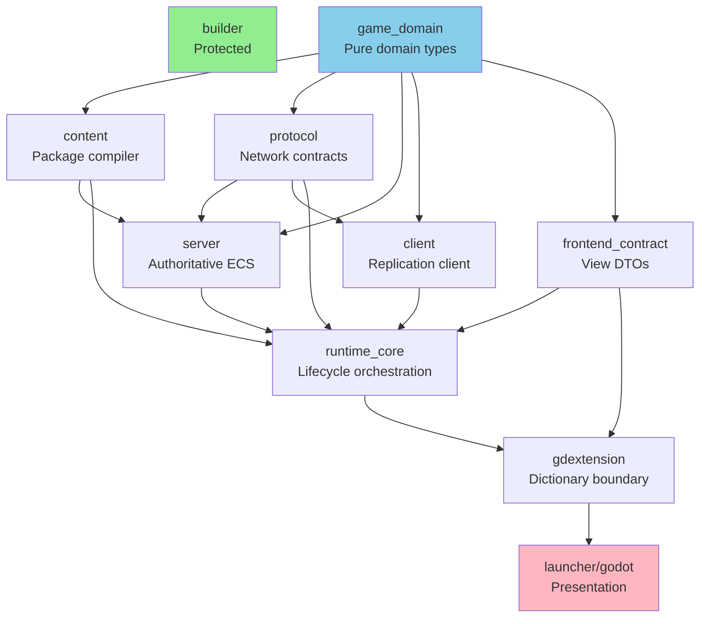
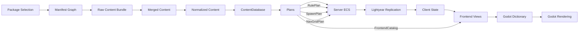

# Architecture Blueprint

<StatusBadge status="in_progress" /> **Created**: 2026-06-09

## Vision

Rusty Warfare should be a **Rust-authoritative, content-compiled, Lightyear-synchronized RTS with Godot presentation**.

The core rule:
> Data is compiled once, rules run once, network state is replicated once, frontend views are projected once.

No layer should rebuild the same gameplay truth under a different name.

## Target Crate Graph



## Data Flow



## Hard Boundaries

| Layer | Responsibility | Must NOT |
|-------|---------------|----------|
| `content` | Pure Rust data compilation | Touch Bevy/Lightyear/Godot/files at runtime |
| `server` | Consume plans, not raw TOML | Parse content files |
| `client` | Consume protocol state | Own authoritative rules |
| `runtime_core` | Lifecycle and frontend projection | Become second gameplay engine |
| `gdextension` | Convert typed Rust → Godot values | Own gameplay API |
| `godot` | Render, input, feedback | Own authoritative state |

## Key Principles

### 1. Ownership Visibility

Rust types must enforce architecture through ownership, not carry bags of fields.

**Anti-pattern**: Giant DTOs crossing all layers
```rust
// ❌ Bad: One struct serves too many masters
struct FrontendSnapshot {
    game_state: ...,
    debug_telemetry: ...,
    network_echo: ...,
    content_catalog: ...,
}
```

**Pattern**: Purpose-specific types
```rust
// ✅ Good: Each type has one clear purpose
struct GameView { ... }
struct DebugView { ... }
struct NetworkDiagnostics { ... }
struct ContentCatalog { ... }
```

### 2. Domain Boundaries

Each crate/module owns one domain.

**Anti-pattern**: God modules
```rust
// ❌ Bad: One file owns everything
// server/src/game/systems.rs (834 lines)
fn apply_commands() { ... }
fn update_movement() { ... }
fn process_economy() { ... }
fn handle_combat() { ... }
```

**Pattern**: Domain plugins
```rust
// ✅ Good: Each domain is independent
// server/src/game/movement/mod.rs
pub struct MovementPlugin;

// server/src/game/economy/mod.rs
pub struct EconomyPlugin;
```

### 3. No Premature Abstraction

**Anti-pattern**: Generic containers
```rust
// ❌ Bad: Bag of maps
struct ContentDatabase {
    units: HashMap<ContentId, UnitTemplate>,
    weapons: HashMap<ContentId, WeaponTemplate>,
    // ...30 more fields
}
```

**Pattern**: Designed domain model
```rust
// ✅ Good: Intentional structure
struct ContentDatabase {
    rules: RulePlan,
    spawn: SpawnPlan,
    catalog: FrontendCatalog,
}
```

### 4. Import Discipline

**Anti-pattern**: Crate-root dumps
```rust
// ❌ Bad: Everything exported from root
pub use snapshot::*;
pub use diagnostics::*;
pub use command_feedback::*;
```

**Pattern**: Explicit public API
```rust
// ✅ Good: Intentional exports
pub use frontend::{FrontendFrame, GameView};
pub use session::NetworkSession;
```

## Architecture Evolution

### Phase A: Quarantine ✅
Stop the bleeding - freeze broad exports, create owner modules

### Phase B: Extract Contracts ✅  
`game_domain`, `frontend_contract` establish boundaries

### Phase C: Split God Objects ✅
Break monoliths into focused modules

### Phase D: Replace Transitional Types 🔄
Move from bags to designed domain models

### Phase E: Enforce 📋
Tests, lints, and documentation lock in the new shape

## Current Status (P15)

✅ **Phases A-C complete**  
🔄 **Phase D in progress**  
📋 **Phase E planned**

::: tip Next Steps
See [Roadmap](/en/roadmap) for detailed phase breakdown and [Progress](/en/progress) for current work.
:::
