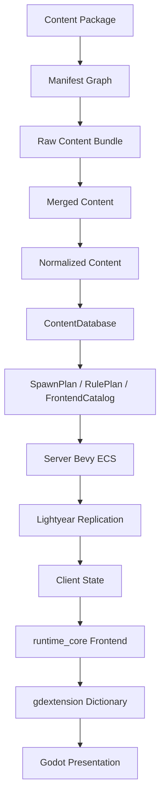

# Roadmap

<StatusBadge status="in_progress" /> **Last updated**: 2026-06-11

## Executive Vision

Rusty Warfare is transforming into an **industrial-grade, Rust-authoritative RTS platform** with:

- ✅ Rust authoritative simulation core
- ✅ Deterministic content-package pipeline
- ✅ Lightyear networking substrate
- ✅ Bevy headless ECS runtime
- ✅ Godot presentation frontend
- 🔄 Tooling for content authors
- 🔄 Behavior-protecting tests

::: tip Current Focus
The `builder` crate remains protected. Refactor focuses on everything else.
:::

## Architecture Vision

## Refactor Phases

### Phase 0: Architecture Quarantine ✅

<ProgressBar :total="6" :completed="6" label="P0 Tasks" />

- ✅ Write clean current-architecture map
- ✅ Mark stale docs as historical
- ✅ Add smoke tests
- ✅ Freeze new crate-root wildcard exports
- ✅ Create import/export audit checklist
- ✅ Protect `builder` from churn

### Phase 1: game_domain Foundation ✅

<ProgressBar :total="5" :completed="5" label="P1 Tasks" />

- ✅ Create pure domain layer (no Bevy/Lightyear/Godot/TOML)
- ✅ Move IDs, commands, room concepts to `game_domain`
- ✅ Update crate dependencies
- ✅ Remove cross-layer DTO duplication
- ✅ Establish hard boundaries

### Phase 2: Content Pipeline ✅

<ProgressBar :total="8" :completed="8" label="P2 Tasks" />

- ✅ Split into raw/normalize/validated/plan/lock phases
- ✅ Create `RulePlan`, `SpawnPlan`, `FrontendCatalog`
- ✅ Add package dependency resolution
- ✅ Implement `extends`, `replace`, patch operations
- ✅ Package lock and fingerprint
- ✅ Friendly diagnostics with source location
- ✅ Namespace `ContentId`
- ✅ Deterministic load order

### Phase 3: Protocol Network Contracts ✅

<ProgressBar :total="5" :completed="5" label="P3 Tasks" />

- ✅ Remove `protocol/src/shared.rs`
- ✅ Split by domain (command, content, room, resource, etc.)
- ✅ Narrow or remove `protocol::prelude::*`
- ✅ Keep Lightyear registration close to definitions
- ✅ Separate commands from transport settings

### Phase 4: Server Gameplay Domains ✅

<ProgressBar :total="7" :completed="7" label="P4 Tasks" />

- ✅ Delete `server/src/game/systems.rs` god module
- ✅ Split into domain modules (commands, movement, economy, production, combat, victory)
- ✅ Create domain plugins or system sets
- ✅ Move state bags to domain resources
- ✅ Add focused tests per domain
- ✅ Remove content file parsing from server
- ✅ Consume plans instead of raw templates

### Phase 5: runtime_core Refactor ✅

<ProgressBar :total="6" :completed="6" label="P5 Tasks" />

- ✅ Split `NetworkApps` god object
- ✅ Separate command session, handshake, local loop
- ✅ Extract command submission, validation, transport
- ✅ Keep prediction/reconciliation as client support
- ✅ Make runtime modes explicit state machines
- ✅ Stop using frontend DTOs for validation

### Phase 6-15: Implementation ✅

- ✅ **P6**: gdextension dictionary boundary
- ✅ **P7**: Godot frontend split
- ✅ **P8**: Official prototype assets
- ✅ **P9**: RulePlan contract
- ✅ **P10-12**: Command debug contracts
- ✅ **P13**: Action schema typing
- ✅ **P14**: Map visual codes data-driven
- ✅ **P15**: Official registry classification

## Upcoming Phases

### Phase 16: Asset/Render Contract 🔨

<StatusBadge status="in_progress" />

<TaskBoard :tasks="[
  {
    id: 'P16',
    title: 'Refactor sprite atlas and animation clips',
    status: 'in_progress',
    description: 'Move render metadata into asset catalog'
  }
]" />

### Phase 17-19: Movement & Logic 📋

<TaskBoard :tasks="[
  {
    id: 'P17',
    title: 'Port deltawater movement model',
    status: 'pending',
    description: 'Acceleration, braking, drive models'
  },
  {
    id: 'P18',
    title: 'Port deltawater Godot controls',
    status: 'pending',
    description: 'Reverse commands, orientation offset'
  },
  {
    id: 'P19',
    title: 'Map logic layers',
    status: 'pending',
    description: 'Compile into pathing/placement rules'
  }
]" />

### Phase 20+: Maturity & Features

- [ ] **P20**: Official gameplay closure (production, construction, repair, reclaim, victory)
- [ ] **P21**: Frontend contract convergence
- [ ] **P22**: Bevy system granularity
- [ ] **P23**: Lightyear contract review
- [ ] **P24**: Godot runtime verification
- [ ] **P25**: Fix known test failures

## Game Design North Star

### Core Fantasy

**Readable industrial war at scale**: Build bases, expand logistics, control terrain, mass-produce forces, and win through positioning, economy, scouting, and combined arms.

### Design Pillars

1. **Clarity first**: Players must understand unit behavior
2. **Server truth first**: Rust server is authoritative
3. **Data first**: Official gameplay is a content package
4. **Modding first**: Validated, deterministic packages
5. **Scale without sludge**: Legible large battles
6. **Terrain matters**: Affects passability, visibility, tactics
7. **Logistics matter**: Resources, queues, tech gates
8. **Networking honesty**: Diagnostics reveal authority

### Initial Official Package

- **Resources**: Credits, energy
- **Terrain**: Land, road, water, blocked, resource fields
- **Movement**: Tracked, wheeled, infantry, air, hover, structure
- **Roles**: Engineer, tank, artillery, anti-air, scout, extractor, factory, turret, command
- **Actions**: Move, stop, build, produce, repair, reclaim, upgrade
- **Combat**: Weapons, projectiles, splash, target filters, cooldowns, turrets
- **Economy**: Extraction, generation, costs, build time, queue limits
- **Victory**: Command structure destroyed, elimination

## Non-Negotiable Rules

No new work should:
- Create giant `Snapshot` structs in crate root
- Add new `pub use *` project preludes
- Create 500+ line domain modules
- Give Godot scripts multiple responsibilities
- Make server parse/guess content
- Use frontend DTOs for authoritative validation

::: details View detailed progress
See [Progress](/en/progress) for phase-by-phase completion status.
:::
