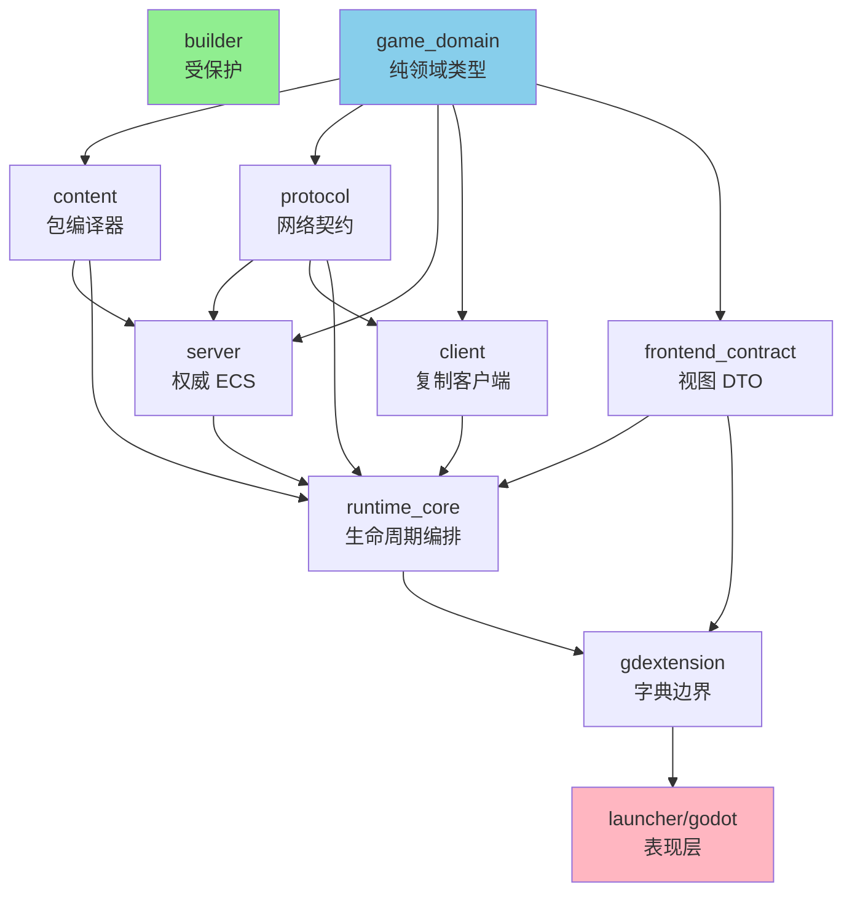
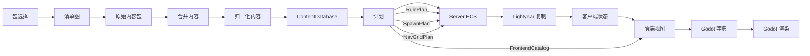

# 架构蓝图

<StatusBadge status="in_progress" /> **创建时间**: 2026-06-09

## 愿景

Rusty Warfare 应该是一个 **Rust 权威、内容编译、Lightyear 同步的 RTS，带 Godot 表现**。

核心规则：
> 数据编译一次，规则运行一次，网络状态复制一次，前端视图投影一次。

任何层都不应在不同名称下重建相同的玩法真相。

## 目标 Crate 图



## 数据流



## 硬边界

| 层 | 职责 | 禁止 |
|-------|---------------|----------|
| `content` | 纯 Rust 数据编译 | 在运行时接触 Bevy/Lightyear/Godot/文件 |
| `server` | 消费计划，而非原始 TOML | 解析内容文件 |
| `client` | 消费协议状态 | 拥有权威规则 |
| `runtime_core` | 生命周期和前端投影 | 成为第二游戏引擎 |
| `gdextension` | 转换类型化 Rust → Godot 值 | 拥有玩法 API |
| `godot` | 渲染、输入、反馈 | 拥有权威状态 |

## 关键原则

### 1. 所有权可见性

Rust 类型必须通过所有权强制架构，而非携带字段袋。

**反模式**: 跨所有层的巨型 DTO
```rust
// ❌ 不好：一个结构服务太多主人
struct FrontendSnapshot {
    game_state: ...,
    debug_telemetry: ...,
    network_echo: ...,
    content_catalog: ...,
}
```

**模式**: 目的明确的类型
```rust
// ✅ 好：每个类型有一个清晰目的
struct GameView { ... }
struct DebugView { ... }
struct NetworkDiagnostics { ... }
struct ContentCatalog { ... }
```

### 2. 领域边界

每个 crate/模块拥有一个领域。

**反模式**: 上帝模块
```rust
// ❌ 不好：一个文件拥有一切
// server/src/game/systems.rs (834 行)
fn apply_commands() { ... }
fn update_movement() { ... }
fn process_economy() { ... }
fn handle_combat() { ... }
```

**模式**: 领域插件
```rust
// ✅ 好：每个领域独立
// server/src/game/movement/mod.rs
pub struct MovementPlugin;

// server/src/game/economy/mod.rs
pub struct EconomyPlugin;
```

### 3. 不要过早抽象

**反模式**: 通用容器
```rust
// ❌ 不好：map 袋
struct ContentDatabase {
    units: HashMap<ContentId, UnitTemplate>,
    weapons: HashMap<ContentId, WeaponTemplate>,
    // ...还有 30 个字段
}
```

**模式**: 设计的领域模型
```rust
// ✅ 好：有意的结构
struct ContentDatabase {
    rules: RulePlan,
    spawn: SpawnPlan,
    catalog: FrontendCatalog,
}
```

### 4. 导入纪律

**反模式**: Crate-root 倾倒
```rust
// ❌ 不好：从 root 导出一切
pub use snapshot::*;
pub use diagnostics::*;
pub use command_feedback::*;
```

**模式**: 显式公共 API
```rust
// ✅ 好：有意的导出
pub use frontend::{FrontendFrame, GameView};
pub use session::NetworkSession;
```

## 架构演进

### 阶段 A: 隔离 ✅
止血 - 冻结广泛导出，创建所有者模块

### 阶段 B: 提取契约 ✅  
`game_domain`、`frontend_contract` 建立边界

### 阶段 C: 拆分上帝对象 ✅
将单体拆分为专注模块

### 阶段 D: 替换过渡类型 🔄
从袋子转向设计的领域模型

### 阶段 E: 强制 📋
测试、lint 和文档锁定新形态

## 当前状态 (P15)

✅ **阶段 A-C 完成**  
🔄 **阶段 D 进行中**  
📋 **阶段 E 已计划**

::: tip 下一步
见[路线图](/zh/roadmap)了解详细阶段分解，见[进度记录](/zh/progress)了解当前工作。
:::
