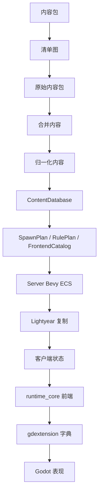

# 路线图

<StatusBadge status="in_progress" /> **最后更新**: 2026-06-11

## 愿景

Rusty Warfare 正在转型为**工业级、Rust 权威 RTS 平台**：

- ✅ Rust 权威仿真核心
- ✅ 确定性内容包管线
- ✅ Lightyear 网络基础
- ✅ Bevy 无头 ECS 运行时
- ✅ Godot 展示前端
- 🔄 内容创作工具
- 🔄 行为保护测试

::: tip 当前重点
`builder` crate 保持受保护状态。重构聚焦于其他部分。
:::

## 架构愿景

## 重构阶段

### 阶段 0: 架构隔离 ✅

<ProgressBar :total="6" :completed="6" label="P0 任务" />

- ✅ 编写清晰的当前架构图
- ✅ 标记过时文档为历史记录
- ✅ 添加冒烟测试
- ✅ 冻结新的 crate-root 通配符导出
- ✅ 创建导入/导出审计清单
- ✅ 保护 `builder` 免受变更影响

### 阶段 1: game_domain 基础 ✅

<ProgressBar :total="5" :completed="5" label="P1 任务" />

- ✅ 创建纯领域层（无 Bevy/Lightyear/Godot/TOML）
- ✅ 将 ID、命令、房间概念移至 `game_domain`
- ✅ 更新 crate 依赖
- ✅ 移除跨层 DTO 重复
- ✅ 建立硬边界

### 阶段 2: 内容管线 ✅

<ProgressBar :total="8" :completed="8" label="P2 任务" />

- ✅ 拆分为 raw/normalize/validated/plan/lock 阶段
- ✅ 创建 `RulePlan`、`SpawnPlan`、`FrontendCatalog`
- ✅ 添加包依赖解析
- ✅ 实现 `extends`、`replace`、patch 操作
- ✅ 包锁和指纹
- ✅ 友好的诊断信息（带源位置）
- ✅ 命名空间 `ContentId`
- ✅ 确定性加载顺序

### 阶段 3: Protocol 网络契约 ✅

<ProgressBar :total="5" :completed="5" label="P3 任务" />

- ✅ 移除 `protocol/src/shared.rs`
- ✅ 按领域拆分（command、content、room、resource 等）
- ✅ 收窄或移除 `protocol::prelude::*`
- ✅ Lightyear 注册靠近定义
- ✅ 分离命令与传输设置

### 阶段 4: Server 玩法域 ✅

<ProgressBar :total="7" :completed="7" label="P4 任务" />

- ✅ 删除 `server/src/game/systems.rs` 上帝模块
- ✅ 拆分为领域模块（commands、movement、economy、production、combat、victory）
- ✅ 创建领域插件或系统集
- ✅ 将状态袋移到领域资源
- ✅ 为每个领域添加专注测试
- ✅ 从服务器移除内容文件解析
- ✅ 消费计划而非原始模板

### 阶段 5: runtime_core 重构 ✅

<ProgressBar :total="6" :completed="6" label="P5 任务" />

- ✅ 拆分 `NetworkApps` 上帝对象
- ✅ 分离命令会话、握手、本地循环
- ✅ 提取命令提交、验证、传输
- ✅ 保持预测/调和为客户端支持
- ✅ 使运行时模式成为显式状态机
- ✅ 停止使用前端 DTO 进行验证

### 阶段 6-15: 实施 ✅

- ✅ **P6**: gdextension 字典边界
- ✅ **P7**: Godot 前端拆分
- ✅ **P8**: Official 原型素材
- ✅ **P9**: RulePlan 契约
- ✅ **P10-12**: 命令调试契约
- ✅ **P13**: Action schema 类型化
- ✅ **P14**: 地图视觉码数据驱动
- ✅ **P15**: Official registry 分类

## 即将到来的阶段

### 阶段 16: Asset/Render 契约 🔨

<StatusBadge status="in_progress" />

<TaskBoard :tasks="[
  {
    id: 'P16',
    title: '重构 sprite atlas 和动画片段',
    status: 'in_progress',
    description: '将渲染元数据移入 asset catalog'
  }
]" />

### 阶段 17-19: 移动与逻辑 📋

<TaskBoard :tasks="[
  {
    id: 'P17',
    title: '移植 deltawater 移动模型',
    status: 'pending',
    description: '加速度、制动、驱动模型'
  },
  {
    id: 'P18',
    title: '移植 deltawater Godot 控制',
    status: 'pending',
    description: '倒车命令、朝向偏移'
  },
  {
    id: 'P19',
    title: '地图逻辑层',
    status: 'pending',
    description: '编译进 pathing/placement 规则'
  }
]" />

### 阶段 20+: 成熟度与特性

- [ ] **P20**: Official 玩法闭环（生产、建造、修理、回收、胜利）
- [ ] **P21**: 前端契约收敛
- [ ] **P22**: Bevy 系统粒度化
- [ ] **P23**: Lightyear 契约复查
- [ ] **P24**: Godot 运行时验证
- [ ] **P25**: 修复已知测试失败

## 游戏设计北极星

### 核心幻想

**可读规模的工业战争**：建造基地、扩张后勤、控制地形、大规模生产部队，通过定位、经济、侦察和兵种配合获胜。

### 设计支柱

1. **清晰优先**：玩家必须理解单位行为
2. **服务器真相优先**：Rust 服务器是权威
3. **数据优先**：官方玩法也是内容包
4. **Mod 优先**：验证的、确定性的包
5. **规模无泥潭**：清晰的大型战斗
6. **地形重要**：影响通行、可见性、战术
7. **后勤重要**：资源、队列、科技门槛
8. **网络诚实**：诊断揭示权威性

### 初始 Official 包

- **资源**：资金、能源
- **地形**：陆地、道路、水域、阻挡、资源田
- **移动**：履带、轮式、步兵、空中、悬浮、建筑
- **角色**：工程车、坦克、火炮、防空、侦察、采集器、工厂、炮塔、指挥部
- **行为**：移动、停止、建造、生产、修理、回收、升级
- **战斗**：武器、弹药、溅射、目标过滤、冷却、炮塔
- **经济**：采集、生成、成本、建造时间、队列限制
- **胜利**：指挥部摧毁、消灭

## 不可协商的规则

新工作不应：
- 在 crate root 创建巨型 `Snapshot` 结构
- 添加新的 `pub use *` 项目 prelude
- 创建 500+ 行领域模块
- 给 Godot 脚本多重职责
- 让服务器解析/猜测内容
- 使用前端 DTO 进行权威验证

::: details 查看详细进度
参见[进度记录](/zh/progress)了解各阶段完成状态。
:::
